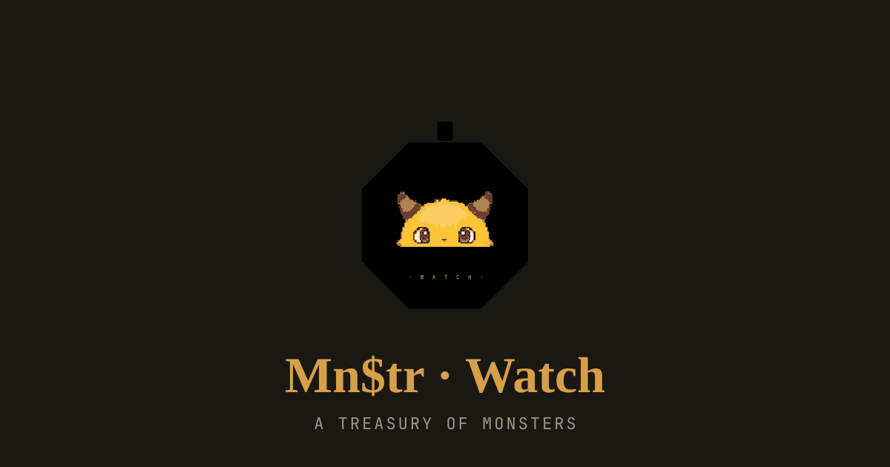
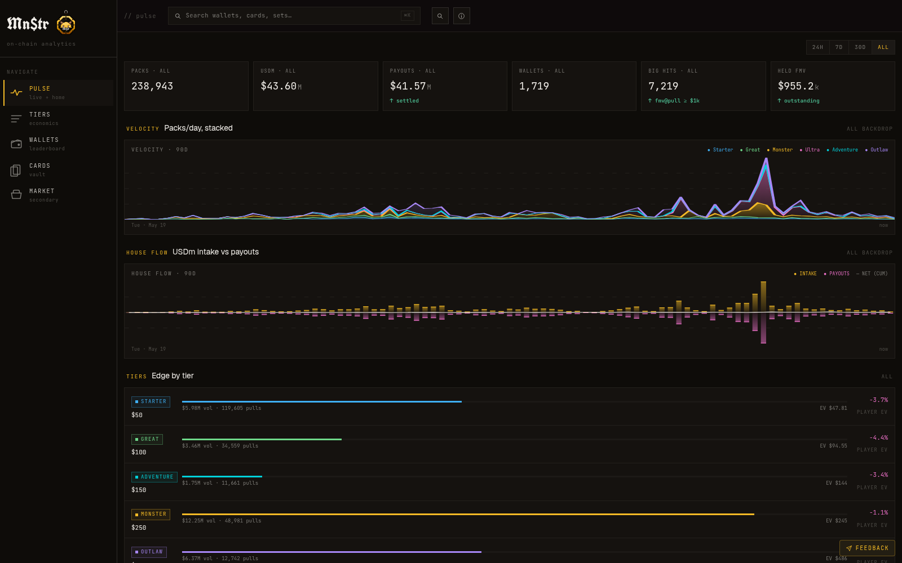
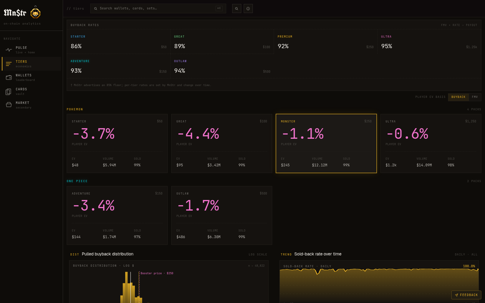
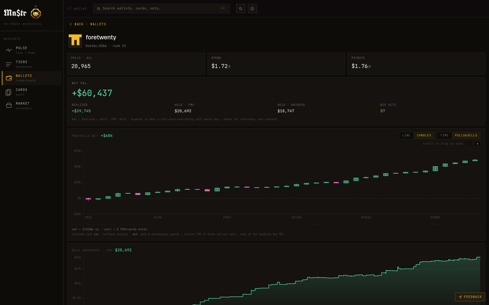

<p align="center">
  
</p>

<h1 align="center">Mn$tr Watch</h1>

<p align="center">
  Independent, on-chain analytics for the <a href="https://mnstr.xyz">MnStr</a> card gacha on MegaETH.<br>
  Live at <strong><a href="https://mnstr.watch">mnstr.watch</a></strong>
</p>

<p align="center">
  <a href="https://mnstr.watch"></a>
  
  
  
</p>

---

MnStr sells gacha packs of graded Pokémon TCG and One Piece slabs, paid in USDm on MegaETH. The cards are **physical slabs in MnStr's vault, not NFTs** — the chain stores a payment receipt and a `playId`, nothing more. That makes the money flows fully public even though the cards aren't tokens, and this repo turns those flows into a live analytics terminal: every pack pulled, every buyback payout, every marketplace sale, and per-wallet P&L — reconstructed purely from on-chain data.

One repo, two processes: a **Next.js 16 dashboard** and a **TypeScript indexer** sharing a Postgres database.

## Screenshots

**Pulse** — live overview: pack velocity by tier, USDm intake vs payouts, house edge per tier, big-hit feed, realtime pull stream (SSE).



**Tiers** — pack economics: per-tier buyback rates, player EV (paper basis), FMV/buyback distributions, sold-back-rate trend, outlier pulls.



**Wallets** — per-wallet portfolio: realized + held P&L, an OHLC-candle portfolio chart over pulls or time, held-inventory FMV history, full pull/sale ledger.



## Features

- **Pulse** (`/`) — windowed KPIs (packs, USDm cycled, settled payouts, active wallets, big hits, held FMV), stacked velocity chart, house-flow chart with cumulative net, live SSE pull feed.
- **Tiers** (`/tiers`) — player-EV gauge with buyback vs raw-FMV basis toggle, buyback-rate table, log-scale payout distribution, sold-back-rate-over-time, paginated outliers.
- **Wallets** (`/wallets`, `/wallets/[addr]`) — 500-row P&L leaderboard with sparklines, per-wallet net P&L split into realized / held-FMV / held-buyback, zoomable line or OHLC-candles portfolio chart.
- **Cards** (`/cards`, `/cards/[slug]`) — the card wall (top hits / most pulled / latest), per-slab detail with FMV history and set comparables.
- **Marketplace** (`/marketplace`) — secondary sales ledger with premium-vs-buyback badges.
- **OBS embed** (`/embed/live`) — chromeless live-feed overlay for streams.
- **Realtime** — Postgres `LISTEN/NOTIFY` fans out to a Server-Sent-Events endpoint (`/api/live/stream`); a LIVE/STALE/OFFLINE chip tracks indexer health via `/api/health` (plain 200/503, pinger-friendly).
- **Alerting** — optional Telegram alerts on poller failure/recovery and on **pack drift**: an hourly check compares the live MnStr catalog against the configured prices and buyback rates, and flags new packs that aren't being indexed yet.

## How it works

```
                        MegaETH mainnet (chainId 4326)
        Alchemy JSON-RPC + WS ─┐         ┌─ Etherscan v2 REST (event backfills)
                               ▼         ▼
                    ┌─────────────────────────────┐
                    │   indexer (tsx scripts/)    │   realtime eth_subscribe
                    │                             │   + 5-min reconcile loop
                    │   enrich ← api.mnstr.xyz    │   card / FMV metadata
                    └──────────────┬──────────────┘
                                   ▼
                    PostgreSQL — pulls, sellbacks, marketplace_sales,
                    usdm_flows, card_fmv_snapshots, wallet_pnl (matview),
                    LISTEN/NOTIFY ticks
                                   ▼
                    ┌─────────────────────────────┐
                    │    Next.js 16 app (:3004)   │   ISR pages + SSE stream
                    └─────────────────────────────┘
```

The indexer watches five things: `PlayAssigned` (a pull, with its USDm amount), `NFTSoldBack` (a sellback — the event carries **no amount**), the marketplace's `CardBought` / `CardPriceUpdated`, and every USDm `Transfer` routed through the operator wallet. Card identity and FMV come from the MnStr API a few seconds after each pull, with the frozen at-pull FMV and the current FMV tracked separately.

Details that keep the numbers honest:

- **Sellback → payout linking.** The buyback payout is a separate operator→player USDm transfer landing ~1 block after the sellback event. The linker does a per-player, one-to-one greedy assignment (oldest sellback → earliest unused transfer in a bounded block window); a naive nearest-block match was ~13% off because sibling sellbacks double-counted transfers. Over 99.9% of realized payouts use the exact on-chain amount, which also makes historical numbers immune to rate retunes.
- **P&L model.** `usdm_flows` (operator-routed USDm in/out) is the realized-cash ground truth; `wallet_pnl` is a materialized view refreshed concurrently after every reconcile: `total_net = realized_net + held_fmv + mp_held_fmv`.
- **Rate-drift tripwire.** Buyback rates live in one place (`lib/tiers.ts`); the SQL mirror in the latest view migration is guarded by a vitest that parses the migration's CASE arms and fails the build if they disagree. At runtime, an hourly check compares the live catalog and pages Telegram on drift — because MnStr *does* retune rates silently.
- **Migrations** are numbered SQL files applied by a tracked runner (`npm run db:migrate`) — `schema_migrations` table, one transaction per file, stops on first failure.

## The packs

Six gacha contracts, one per pack. Buyback rates are set by MnStr and **retuned over time** (the advertised "85%" is a floor, not the rate) — values below are live as of August 2026 and monitored for drift:

| Pack | IP | Price | Buyback | Contract |
|---|---|---:|---:|---|
| Starter | Pokémon | $50 | 86% | `0xdea1d72f08d83e36946128603d4cd0a180a938a9` |
| Great | Pokémon | $100 | 89% | `0x79dd7da84a93abbd304d41cf0addb20f8435f532` |
| Monster | Pokémon | $250 | 92% | `0x6a786932b1ca83e2343b85483101c5b820860ac4` |
| Ultra | Pokémon | $1,250 | 95% | `0xebb285b5cd4610d0f6dc538379a7027f02274ca2` |
| Adventure | One Piece | $150 | 93% | `0x1472a250e3663a33a62142a8c68b6c3c611e47bf` |
| Outlaw | One Piece | $500 | 94% | `0xd7119f7251afd521847ae6bca51a56c3f24971e3` |

Supporting contracts: USDm `0xFAfDdbb3FC7688494971a79cc65DCa3EF82079E7`, card marketplace `0x5db1075782527e5ddacfdd816ea0c59b8c6eaad3`, operator wallet `0x61fccfc0279b09c387608eff56fd9187e61d2874`. Explorer: [mega.etherscan.io](https://mega.etherscan.io).

## Methodology & caveats

The dashboard is deliberately explicit about what the chain can and cannot prove (the in-app "Methodology" sheet mirrors this):

- **FMV is MnStr's vault appraisal**, not market consensus — it can move with no on-chain event. Every derived figure is labelled accordingly.
- **Two FMVs per pull**: the value frozen at pull time (used for paper P&L and EV) and the current re-marked value (snapshotted hourly). They diverge, and each chart picks one deliberately.
- **Chain-only counts** run ~5% below MnStr's own counters, which include plays with no on-chain footprint (e.g. free spins). ~0.4% of pulls never had a card assigned and are excluded from EV/distribution math.
- **Player EV is paper-basis by design**: every pull's at-pull FMV × the current tier buyback rate, whether or not the card was actually sold back. A realized basis would flatter tiers where players hold.
- **Redemption is off-chain**: the `NFTRedeemed` event has never fired, so "shipped home" vs "still in vault" is not determinable on-chain (either way the wallet owns the asset at FMV, so net P&L is unaffected).
- **The marketplace has no player-sellers** — the protocol sells from its own vault, so sellers render as "MnStr vault".
- **Pooled claims**: many pulls share one card slug; serial-level ownership is not recoverable from chain data.

## Getting started

Prereqs: Node 20+, PostgreSQL, an [Alchemy](https://www.alchemy.com/) app with MegaETH access, and an [Etherscan](https://etherscan.io/apis) v2 API key.

```bash
npm install
cp .env.example .env        # fill in DATABASE_URL, ALCHEMY_RPC, ETHERSCAN_KEY
npm run db:migrate          # apply sql/ migrations (tracked, transactional)

npm run backfill            # index all pulls from contract deploy
npm run backfill-sellbacks
npm run backfill-marketplace
npm run cli backfill-usdm-flows
npm run cli link-sellbacks  # match sellbacks to their on-chain payouts
npm run enrich              # card + FMV metadata from the MnStr API

npm run poller              # realtime WS + 5-min reconcile loop (keep running)
npm run dev                 # dashboard on http://localhost:3004
```

### CLI

The indexer is a single dispatcher — `npm run cli <command>` (entry: `scripts/index.ts`):

| Command | What it does |
|---|---|
| `poll` / `poll-once` | reconcile loop / single cycle |
| `backfill [tier]` / `reindex [tier]` | pull events from deploy / from scratch |
| `backfill-sellbacks` · `backfill-marketplace` · `backfill-usdm-flows` | per-domain backfills (each with a `reindex-` variant) |
| `link-sellbacks` | recompute sellback→payout assignment (idempotent) |
| `enrich [limit]` / `enrich-recent [hours]` / `restatus [limit]` | card metadata + status refresh |
| `refresh-fmvs` | re-mark current FMVs, snapshot history |
| `audit-usdm [n]` | spot-check USDm flow classification |
| `check-packs` | catalog drift check — exit 0 clean / 1 unreachable / 2 drift (CI-friendly) |
| `leaderboard` | snapshot the wallet leaderboard |

## Testing

```bash
npm run test        # vitest: payout linker, ABI decoders, USDm classification,
                    # and the tier-config ↔ SQL drift tripwire
npm run typecheck
npm run predeploy   # typecheck + test + build — the deploy gate
```

## Deployment

Production runs under PM2 as two apps — the Next.js server and the poller — using the committed `deploy/ecosystem.config.cjs`. `deploy/deploy.sh` gates on `npm run predeploy`, rsyncs the repo, applies migrations, rebuilds remotely, and reloads PM2. Point an external uptime pinger at `GET /api/health`.

## Disclaimer

Mn$tr Watch is an independent community project, **not affiliated with MnStr**. All metrics are reconstructed from public on-chain data and MnStr's public API; valuations rest on MnStr's own FMV appraisals. Nothing here is financial advice.
